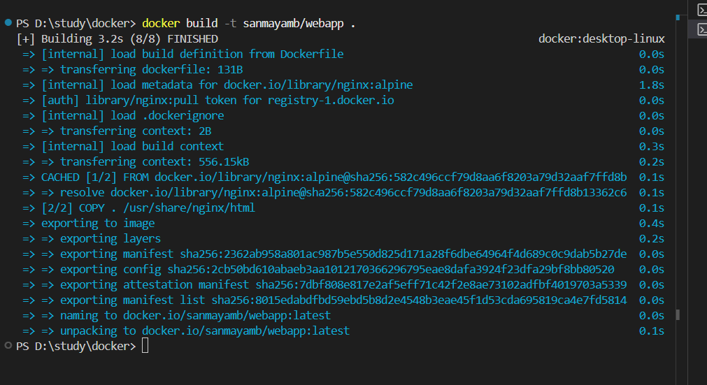
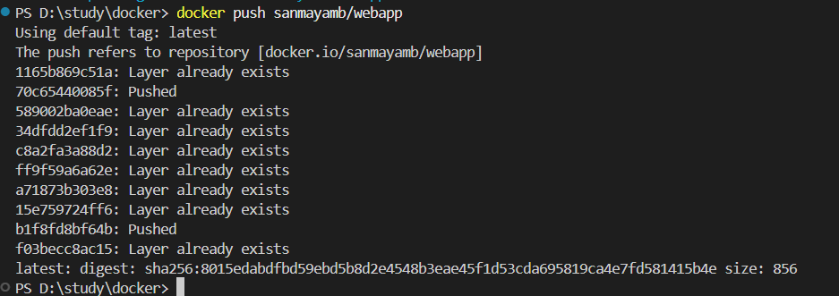
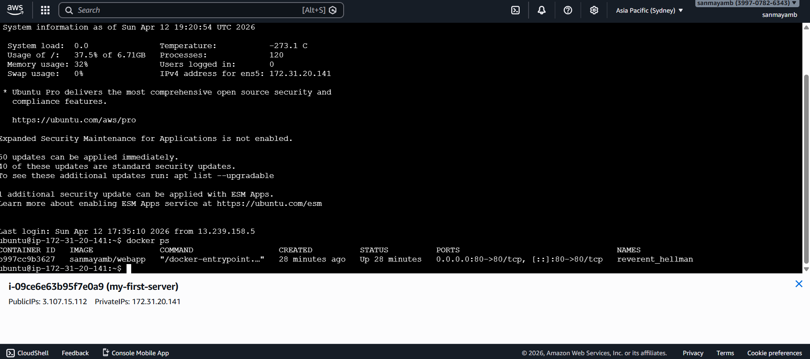
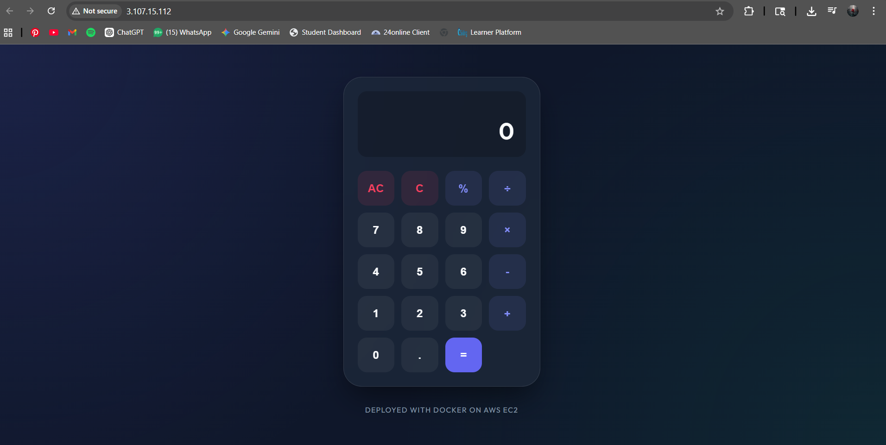

http://3.107.15.112

# Docker + AWS EC2 Deployment

📌 **Project Description**

This project is a simple web application (Glassmorphism Calculator) built using HTML, CSS, and JavaScript. 
It is containerized using Docker and deployed on an AWS EC2 instance.

🐳 **Docker Commands**

```bash
docker build -t lakshitraina/webapp .

docker login

docker push lakshitraina/webapp
```

☁️ **AWS EC2 Deployment**

```bash
docker pull lakshitraina/webapp

docker run -d -p 80:80 lakshitraina/webapp
```

🌐 **Live URL**

[http://3.107.15.112](http://3.107.15.112)

📸 **Screenshots**

### ✅ Docker build success


### ✅ Docker push success


### ✅ EC2 terminal running container


### ✅ Website opened in browser


---
*Deployed with ❤️ by Lakshit*
